## Queue

- 삽입, 삭제 제한

  - 뒤 : 삽입 (`enQueue`), 앞 : 삭제 (`deQueue`)

- FIFO

  - 

- 연산

  |      연산       |              기능               |
  | :-------------: | :-----------------------------: |
  | `enQueue(item)` |     뒤쪽 (rear 다음)에 삽입     |
  |   `deQueue()`   |   앞쪽 (front)에서 삭제, 반환   |
  | `createQueue()` |         공백 queue 생성         |
  |   `isEmpty()`   |          공백 상태인지          |
  |   `isFull()`    |          포화 상태인지          |
  |    `Qpeek()`    | 앞쪽 (front)에서 삭제 없이 반환 |

  - `createQueue()`

    

  - `enQueue(A)`

    

  - `enQueue(B)`

    

  - `deQueue()`

    

  - `enQueue(C)`

    

  - `deQueue()`

    

  - `deQueue()`

    

### 선형 Queue

- 1차원 배열

- front : 첫 번째 원소 index, rear : 마지막 원소 index

  - 초기 상태 : front = rear = -1
  - 공백 상태 : front = rear
  - 포화 상태 : rear = n - 1

- 초기 공백 큐 생성

  - 크기 n 1차원 배열 생성
  - front, rear -1로 초기화

- 삽입 : `enQueue(item)`

  - rear 값을 하나 증가 -> 삽입 자리 마련

  - Q[rear]에 item 저장

  - ```pseudocode
    def enQueue(item):
    	global rear
    	if isFull():
    		print("Queue_Full")
    	else:
    		rear = rear + 1;
    		Q[rear] = item;
    ```

- 삭제 : `deQueue()`

  - front 값 하나 증가 -> 첫 번째 원소 이동

  - 새로운 첫 번째 원소 리턴 = 삭제

  - ```pseudocode
    deQueue()
    	if(isEmpty()) then Queue_Empty();
    	else{
    		front = front + 1;
    		return Q[front]
    	}
    end deQueue()
    ```

- 공백, 포화 상태 검사 : `isEmpty()`, `isFull()`

  - 공백 : front = rear

  - 포화 : rear = n - 1

  - ```pseudocode
    def isEmpty():
    	return front == rear
    	
    def isFull():
    	return rear == len(Q) - 1
    ```

- 검색 : `Qpeek()`

  - 가장 앞 원소 검색, 반환

  - 현재 front 한 자리 뒤 (front + 1) -> 큐 첫 번째 원소 반환

  - ```pseudocode
    def Qpeek():
    	if isEmpty():
    		print("Queue_Empty")
    	else:
    		return Q[front + 1]
    ```

#### 문제점

- 잘못된 포화 상태 인식
  - 배열 앞부분에 활용할 수 있는 공간 O but 포화 상태로 인식
  - 

- 해결책
  - 연산할 때마다 저장 원소 배열 앞부분으로 이동
    - 원소 이동에 시간 소요 -> 효율 down
    - 
  - 원형 큐
    - 배열 처음 끝 연결
    - 

### 원형 Queue

- 초기 공백 : front = rear = 0

- index 순환

  - n -1 -> 0
  - `mod` 연산자

- front : 항상 빈 자리

  - |            |        삽입 위치        |         삭제 위치         |
    | :--------: | :---------------------: | :-----------------------: |
    | 선형 Queue |     rear = rear + 1     |     front = front + 1     |
    | 원형 Queue | rear = (rear + 1) mod n | front = (front + 1) mod n |

  - `create Queue`

    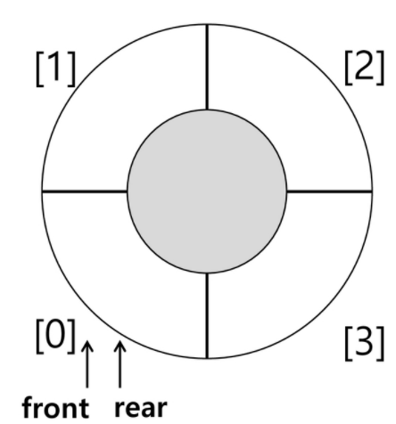

  - `enQueue(A);`

    

  - `enQueue(B);`

    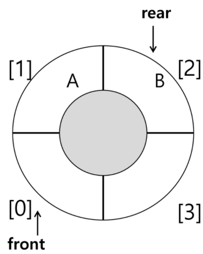

  - `deQueue();`

    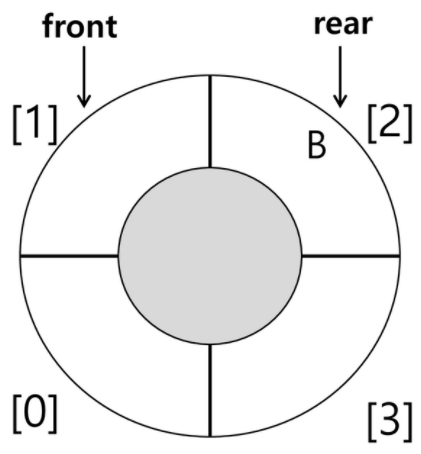

  - `enQueue(C);`

    

  - `enQueue(D);`

    

- 초기 공백 Queue 생성

  - 크기 n 1차원 배열
  - front, rear 0 초기회

- 공백, 포화 상태 검사 : `isEmpty()`, `isFull()`

  - 공백 : front = rear

  - 포화 : 삽입할 rear 다음 위치 = 현재 front -> (rear + 1)  mod n = front

  - ```pseudocode
    def isEmpty():
    	return front == rear
    	
    def isFull():
    	return (rear + 1) % len(cQ) == front
    ```

- 삽입 : `enQueue(item)`

  - rear 조정 -> 새로운 삽입 자리 마련 : rear = (rear + 1) mod n

  - cQ[rear]에 item 저장

  - ```pseudocode
    def enQueue(item):
    	global rear
    	if isFull():
    		print("Queue_Full")
    	else:
    		rear = (rear + 1) % len(cQ)
    		cQ[rear] = item
    ```

- 삭제 : `deQueue()`, `delete()`

  - front 값 조정 -> 삭제할 자리

  - 새로운 front 리턴 = 삭제

  - ```pseudocode
    def deQueue():
    	global front
    	if isEmpty():
    		print("Queue_Empty")
    	else:
    		front = (front + 1) % len(cQ)
    		return cQ[front]
    	
    def delete():
    	global front
    	if isEmpty():
    		print("Queue_Empty")
    	else:
    		front = (front + 1) % len(cQ)
    ```

### 연결 Queue

- 단순 연결 리스트 (Linked List) 이용

  - 원소 : 단순 연결 리스트 노드
  - 순서 : 링크로 연결
  - front : 첫 번째 노드 링크, rear : 마지막 노드 링크

- 상태

  - 초기 : front = rear = null
  - 공백 : front = rear = null
  - 

- 연산 과정

  - 공백 Queue 생성 : `createLinkedQueue();`

    

  - 원소 A 삽입 : `enQueue(A);`

    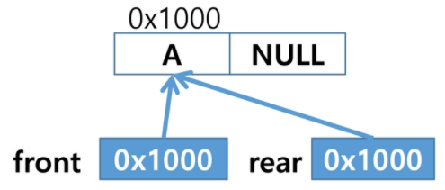

  - 원소 B 삽입 : `enQueue(B);`

    

  - 원소 삭제 : `deQueue();`

    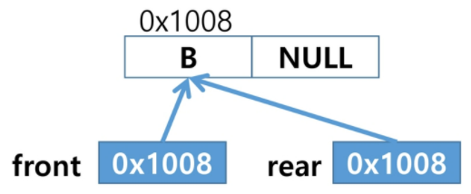

  - 원소 C 삽입 : `enQueue(C);`

    

  - 원소 삭제 : `deQueue();`

    

  - 원소 삭제 : `deQueue();`

    

- 구현

  - 초기 공백 큐 생성 : `createLinkedQueue()`

    - 리스트 노드 없이 포인터 변수만

    - front, rear None으로 초기화

    - ```pseudocode
      front = None
      rear = None
      ```

  - 공백 검사 : `isEmpty()`

    - front = rear = null

    - ```pseudocode
      def isEmpty():
      	return front == None
      ```

  - 삽입 : `enQueue(item)`

    - 새로운 노드 생성 후 데이터 필드에 item 저장

    - 공백, X -> front, rear  지정

    - ```pseudocode
      def enQueue(item):  # 연결 Queue 삽입 연산
      	global front, rear
      	newNode = Node(item)  # 새로운 노드 생성
      	f isEmpty():  # Queue 비어있으면
      		front = newNode
      	else:
      		rear.next = newNode
      	rear = newNode
      ```

  - 삭제 : `deQueue()`

    - old가 지울 노드 -> front 재설정

    - 삭제 후 공백 : rear None 재설정

    - old가 가리키는 노드 삭제, 반환

    - ```pseudocode
      def deQueue():  # 연결 Queue의 삭제 연산
      	global front, rear
      	if isEmpty():
      		print("Queue_Empty")
      		return None
      	
      	item = front.item
      	front = front.next
      	if isEmpty():
      		rear = None
      	return item
      ```

  - ```python
    class Node:
        def __init__(self, item, n=Node):
            self.item = item
            self.next = n
           
    def enQueue(item):  # 연결 Queue 삽입 연산
    	global front, rear
    	newNode = Node(item)  # 새로운 노드 생성
    	f isEmpty():  # Queue 비어있으면
    		front = newNode
    	else:
    		rear.next = newNode
    	rear = newNode
        
    def isEmpty():
    	return front == None
    
    def deQueue():  # 연결 Queue의 삭제 연산
    	global front, rear
    	if isEmpty():
    		print("Queue_Empty")
    		return None
    	
    	item = front.item
    	front = front.next
    	if isEmpty():
    		rear = None
    	return item
    
    def Qpeek():
        return front.item
    
    def printQ():
        f = front
        s = ""
        while f:
            s += f.item + " "
            f = f.next
        return s
    ```

### 우선순위 큐 (Priority Queue)

- 적용 분야 : 시뮬레이션, 네트워크 트래픽 제어, OS 테스크 스케줄링
- 구현
  - 배열
    - 삽입 시 우선순위 비교 -> 적절 위치에  삽입
    - 가장 앞에 최고 우선 순위
    - 문제점 : 원소 재배치 -> 시간, 메모리 낭비
  - 리스트
- 연산
  - 삽입 : `enQueue`, 삭제 : `deQueue`
  - 

### 버퍼 (Buffer)

- 일시적으로 보관 메모리 영역
- 입출력, 네트워크 관련 기능
- 키보드 버퍼
  - 

### BFS (Breadth First Search)

- 탐색 시작점 인접 정점을 먼저 모두 차례로 방문 -> 방문했던 정점을 시작점으로 다시 인접 정점을 차례로 방문

- 

- ```pseudocode
  def BFS(G, v)  # 그래프 G, 시작점 v
  	visited = [0] * n  # n : 정점 개수
  	queue = []  # 큐 생성
  	queue.append(v)  # 시작점 v 큐에 삽입
  	while queue:  # 큐가 비어있지 않으면
  		t = queue.pop(0)  # 첫 번째 원소 반환
  		if not visited[t]:  # 방문되지 않은 곳이면
  			visited[t] = True  # 방문한 것으로 표시
  			visit(t)
  		for i in G[t]:  # t와 연결된 모든 선
  			if not visited[i]:  # 방문되지 않은 곳이면
  				queue.append(i)  # 큐에 추가
  ```

- 예제

  - 초기 상태 : visited 배열 초기화, Q 생성, 시작점, enqueue

    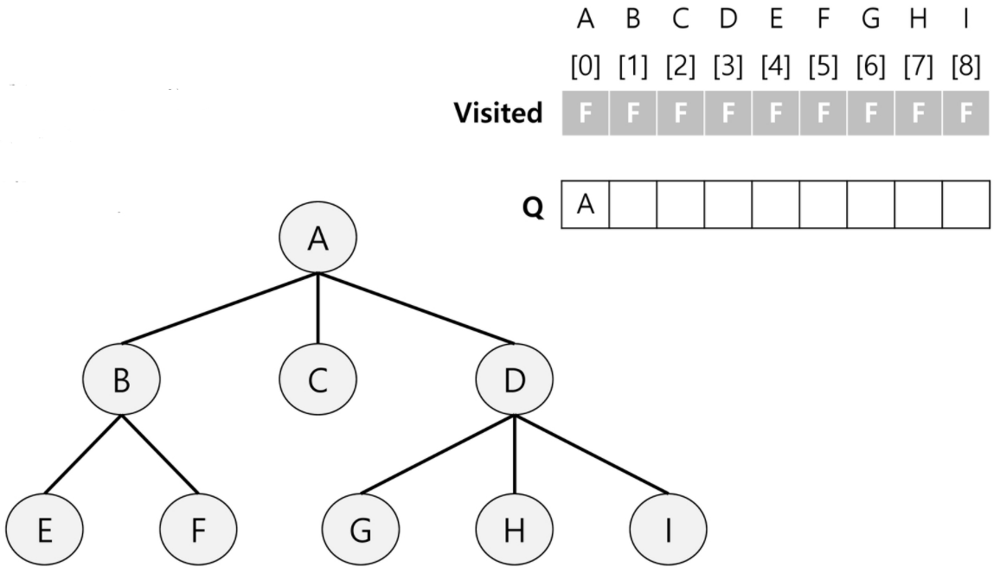

  - A점부터 시작 : dequeue A, A 방문한 것으로 표시, A 인접점 enqueue

    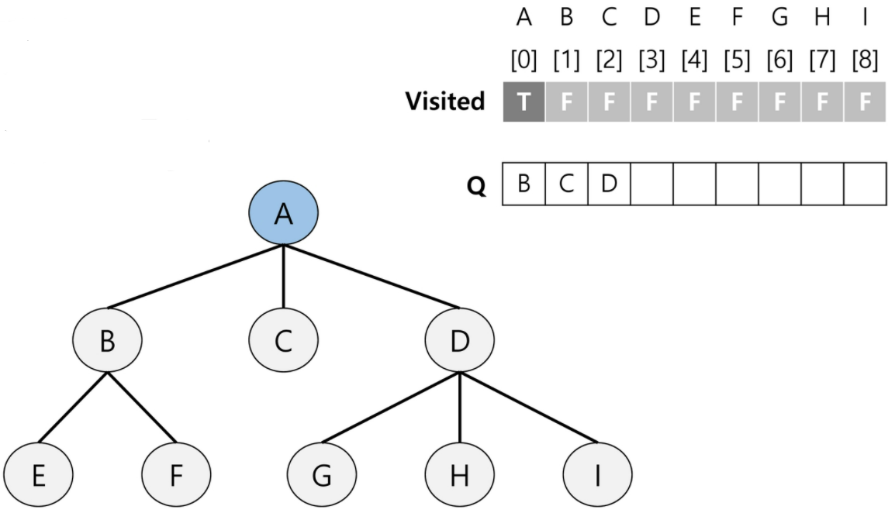

  - 탐색 진행 : dequeue B, B 방문한 것으로, B 인접점 enqueue

    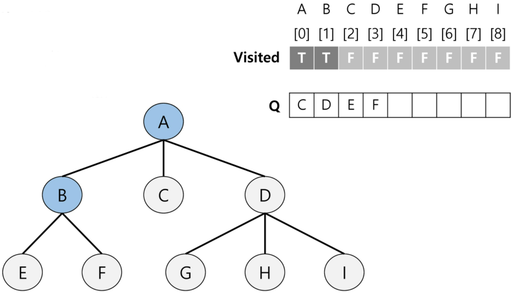

  - 탐색 진행 : dequeue C. C 방문한 것으로, C 인접점 enqueue

    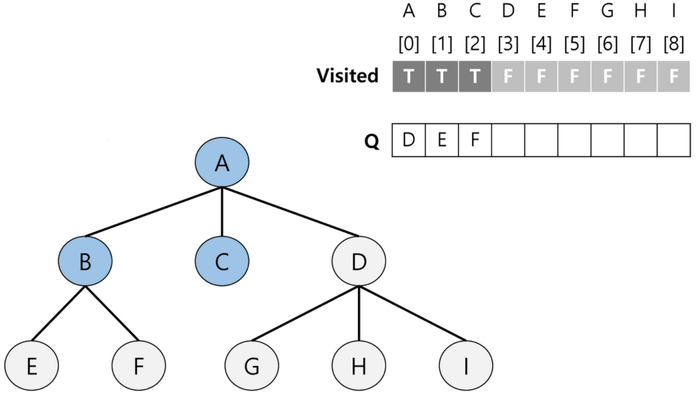

  - 탐색 진행 : dequeue D, D 방문한 것으로, D 인접점 enqueue

    

  - 탐색 진행 : dequeue E, E 방문한 것으로, E 인접점 enqueue

    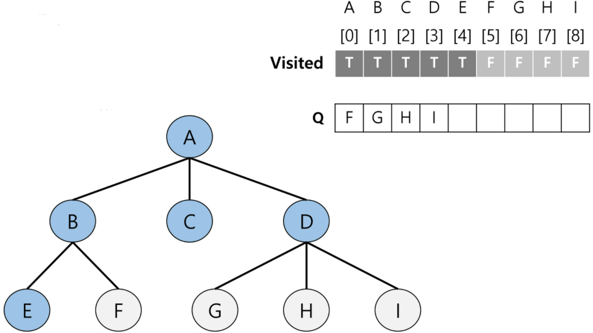

  - 탐색 진행 : dequeue F, F 방문한 것으로, F 인접점 enqueue

    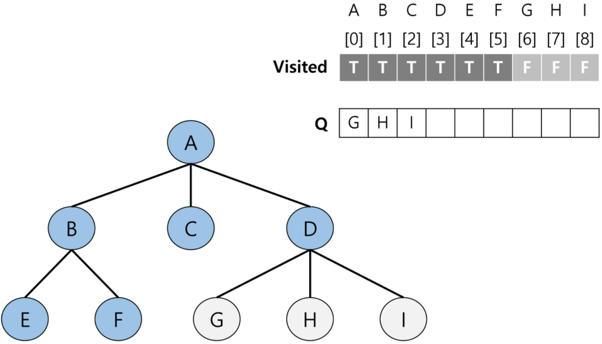

  - 탐색 진행 : dequeue G, G 방문한 것으로, G 인접점 enqueue

    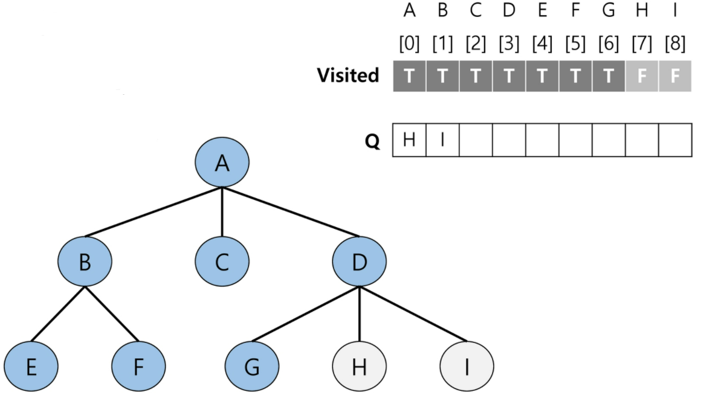

  - 탐색 진행 : dequeue H, H 방문한 것으로, H 인접점 enqueue

    

  - 탐색 진행 : dequeue I, I 방문한 것으로, I 인접점 enqueue

    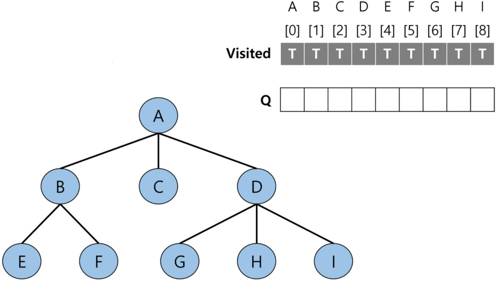

  - 탐색 종료

    

