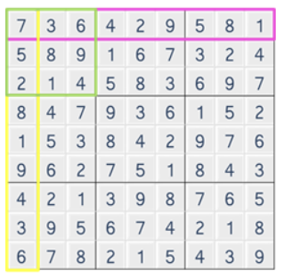

# 1974. 스도쿠 검증

> https://bit.ly/3k9pryi
>
> 스도쿠는 숫자퍼즐로, **가로 9칸 세로 9칸**으로 이루어져 있는 표에 **1 부터 9 까지의 숫자**를 채워넣는 퍼즐이다.
>
> 같은 줄에 **1 에서 9 까지의 숫자를 한번씩만 넣고, 3 x 3 크기의 작은 격자 또한, 1 에서 9 까지의 숫자가 겹치지 않아야 한다.**
>
> 
>
> 입력으로 9 X 9 크기의 스도쿠 퍼즐의 숫자들이 주어졌을 때, 위와 같이 겹치는 숫자가 없을 경우, 1을 정답으로 출력하고 그렇지 않을 경우 0 을 출력한다.
>
>
> **[제약 사항]**
>
> \1. 퍼즐은 모두 숫자로 채워진 상태로 주어진다.
>
> \2. 입력으로 주어지는 퍼즐의 모든 숫자는 1 이상 9 이하의 정수이다.
>
>
> **[입력]**
>
> 입력은 첫 줄에 총 테스트 케이스의 개수 T가 온다.
>
> 다음 줄부터 각 테스트 케이스가 주어진다.
>
> 테스트 케이스는 9 x 9 크기의 퍼즐의 데이터이다.
>
> 10
> 7 3 6 4 2 9 5 8 1
> 5 8 9 1 6 7 3 2 4
> 2 1 4 5 8 3 6 9 7
> 8 4 7 9 3 6 1 5 2
> 1 5 3 8 4 2 9 7 6
> 9 6 2 7 5 1 8 4 3
> 4 2 1 3 9 8 7 6 5
> 3 9 5 6 7 4 2 1 8
> 6 7 8 2 1 5 4 3 9
> …
>
>
> **[출력]**
>
> 테스트 케이스 t에 대한 결과는 “#t”을 찍고, 한 칸 띄고, 정답을 출력한다.
>
> (t는 테스트 케이스의 번호를 의미하며 1부터 시작한다.)
>
> \#1 1
> ...

- 풀이

```python
def sudoku_check():
    # 스도쿠 판 2중 리스트로 생성
    sudoku_lst = []
    for number in range(9):
        sudoku_num = list(map(int, input().split()))
        sudoku_lst.append(sudoku_num)
    # 가로줄, 세로줄 겹치는 숫자 확인
    for y in range(9):
        column = []
        row = []
        for x in range(9):
            column.append(sudoku_lst[y][x])
            row.append(sudoku_lst[x][y])
        if len(set(column)) != 9 or len(set(row)) != 9:
            return 0
    # 3*3 칸 9개의 겹치는 숫자 확인
    for i in range(0, 9, 3):
        column = []
        row = []
        for b in range(i, i + 3):
            for c in range(3):
                column.append(sudoku_lst[b][c])
                row.append(sudoku_lst[c][b])
        if len(set(column)) != 9 or len(set(row)) != 9:
            return 0

    return 1


T = int(input())

for tc in range(1, T + 1):
    print(f'#{tc} {sudoku_check()}')
```

