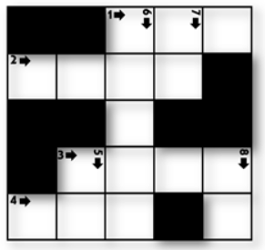

# 1979. 어디에 단어가 들어갈 수 있을까

> https://bit.ly/3AYtbJH
>
> N X N 크기의 단어 퍼즐을 만들려고 한다. 입력으로 단어 퍼즐의 모양이 주어진다.
>
> 주어진 퍼즐 모양에서 특정 길이 K를 갖는 단어가 들어갈 수 있는 자리의 수를 출력하는 프로그램을 작성하라.
>
> **[예제]**
>
> N = 5, K = 3 이고, 퍼즐의 모양이 아래 그림과 같이 주어졌을 때
>
> 길이가 3 인 단어가 들어갈 수 있는 자리는 2 곳(가로 1번, 가로 4번)이 된다.
>
> 
>
> **[제약 사항]**
>
> \1. N은 5 이상 15 이하의 정수이다. (5 ≤ N ≤ 15)
>
> \2. K는 2 이상 N 이하의 정수이다. (2 ≤ K ≤ N)
>
>
> **[입력]**
>
> 입력은 첫 줄에 총 테스트 케이스의 개수 T가 온다.
>
> 다음 줄부터 각 테스트 케이스가 주어진다.
>
> 테스트 케이스의 첫 번째 줄에는 단어 퍼즐의 가로, 세로 길이 N 과, 단어의 길이 K 가 주어진다.
>
> 테스트 케이스의 두 번째 줄부터 퍼즐의 모양이 2차원 정보로 주어진다.
>
> 퍼즐의 각 셀 중, 흰색 부분은 1, 검은색 부분은 0 으로 주어진다.
>
> 10
> 5 3
> 0 0 1 1 1
> 1 1 1 1 0
> 0 0 1 0 0
> 0 1 1 1 1
> 1 1 1 0 1
> 5 3
> 1 0 0 1 0
> 1 1 0 1 1
> 1 0 1 1 1
> 0 1 1 0 1
> 0 1 1 1 0
> …
>
>
> **[출력]**
>
> 테스트 케이스 t에 대한 결과는 “#t”을 찍고, 한 칸 띄고, 정답을 출력한다.
>
> (t는 테스트 케이스의 번호를 의미하며 1부터 시작한다.)
>
> \#1 2
> \#2 6
> ...

- 풀이

```python
T = int(input())
for tc in range(1, T + 1):
    N, K = map(int, input().split())

    arr = [list(map(int, input().split())) for _ in range(N)]
    ans = 0

    # 가로
    for i in range(N):
        cnt = 0
        for j in range(N):
            if arr[i][j] == 1:  # 1 만나면 cnt 1 더함
                cnt += 1
            else:  # 0 만나면 초기화
                if cnt == K:
                    ans += 1
                cnt = 0
        if cnt == K:
            ans += 1

    # 세로
    for i in range(N):
        cnt = 0
        for j in range(N):
            if arr[j][i] == 1:
                cnt += 1
            else:
                if cnt == K:
                    ans += 1
                cnt = 0
        if cnt == K:
            ans += 1

    print(f"#{tc} {ans}")
```

