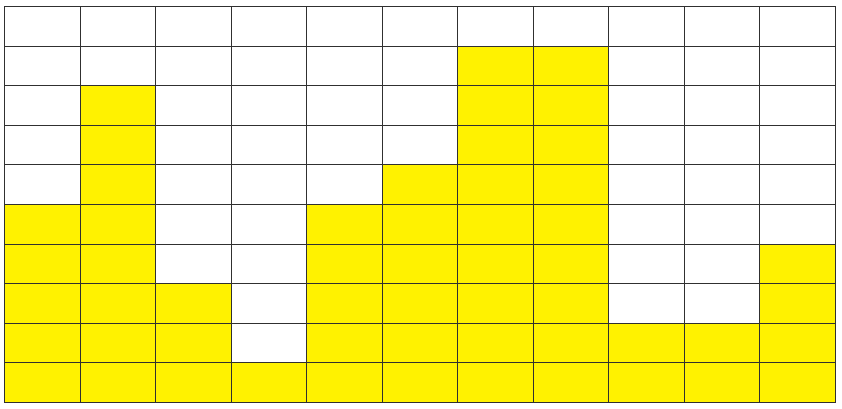
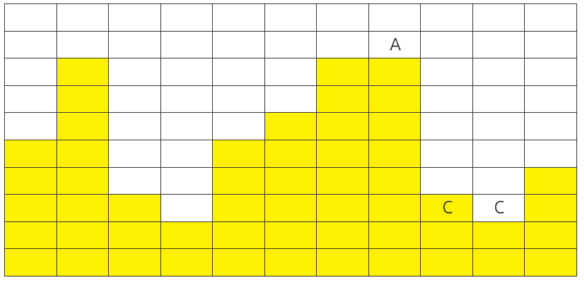

# 1208. Flatten

> https://swexpertacademy.com/main/code/problem/problemDetail.do?contestProbId=AV139KOaABgCFAYh&categoryId=AV139KOaABgCFAYh&categoryType=CODE&problemTitle=flatten&orderBy=FIRST_REG_DATETIME&selectCodeLang=ALL&select-1=&pageSize=10&pageIndex=1
>
> 한 쪽 벽면에 다음과 같이 노란색 상자들이 쌓여 있다.
>
> 높은 곳의 상자를 낮은 곳에 옮기는 방식으로 최고점과 최저점의 간격을 줄이는 작업을 평탄화라고 한다.
>
> 평탄화를 모두 수행하고 나면, 가장 높은 곳과 가장 낮은 곳의 차이가 최대 1 이내가 된다.
>
> 평탄화 작업을 위해서 **상자를 옮기는 작업 횟수에 제한**이 걸려있을 때, 제한된 횟수만큼 옮기는 작업을 한 후 **최고점과 최저점의 차이를 반환**하는 프로그램을 작성하시오.
>
> 
>
> 가장 높은 곳에 있는 상자를 가장 낮은 곳으로 옮기는 작업을 덤프라고 정의한다.
>
> 위의 예시에서 제1회 덤프를 수행한 이후 화면은 다음과 같다.
>
> 
>
> A부분의 상자를 가장 낮은 B부분에 덤프하였으며, A대신 A’부분의 상자를 사용해도 무방하다.
>
> 다음은 제2회 덤프를 수행한 이후의 화면이다.
>
> 
>
> A’부분의 상자를 옮겨서, C부분에 덤프하였다. 이때 C 대신 C’부분에 덤프해도 무방하다.
>
> 2회의 덤프 후, 최고점과 최저점의 차이는 8 – 2 = 6 이 되었다 (최초덤프 이전에는 9 – 1 = 8 이었다).
>
> 덤프 횟수가 2회로 제한된다면, 이 예시 문제의 정답은 6이 된다.
>
> **[제약 사항]**
>
> 가로 길이는 항상 100으로 주어진다.
>
> 모든 위치에서 상자의 높이는 1이상 100이하로 주어진다.
>
> 덤프 횟수는 1이상 1000이하로 주어진다.
>
> 주어진 덤프 횟수 이내에 평탄화가 완료되면 더 이상 덤프를 수행할 수 없으므로 그 때의 최고점과 최저점의 높이 차를 반환한다 (주어진 data에 따라 0 또는 1이 된다).
>
> **[입력]**
>
> 총 10개의 테스트 케이스가 주어지며, 각 테스트 케이스의 첫 번째 줄에는 덤프 횟수가 주어진다. 그리고 다음 줄에 각 상자의 높이값이 주어진다.
>
> ```
> 834
> 42 68 35 1 70 25 79 59 63 65 6 46 82 28 62 92 96 43 28 37 92 5 3 54 93 83 22 17 19 96 48 27 72 39 70 13 68 100 36 95 4 12 23 34 74 65 42 12 54 69 48 45 63 58 38 60 24 42 30 79 17 36 91 43 89 7 41 43 65 49 47 6 91 30 71 51 7 2 94 49 30 24 85 55 57 41 67 77 32 9 45 40 27 24 38 39 19 83 30 42 
> 617
> 16 40 59 5 31 78 7 74 87 22 46 25 73 71 30 78 74 98 13 87 91 62 37 56 68 56 75 32 53 51 51 42 25 67 31 8 92 8 38 58 88 54 84 46 10 10 59 22 89 23 47 7 31 14 69 1 92 63 56 11 60 25 38 49 84 96 42 3 51 92 37 75 21 97 22 49 100 69 85 82 35 54 100 19 39 1 89 28 68 29 94 49 84 8 22 11 18 14 15 10 
> 369
> 36 52 1 50 20 57 99 4 25 9 45 10 90 3 96 86 94 44 24 88 15 4 49 1 59 19 81 97 99 82 90 99 10 58 73 23 39 93 39 80 91 58 59 92 16 89 57 12 3 35 73 56 29 47 63 87 76 34 70 43 45 17 82 99 23 52 22 100 58 77 93 90 76 13 1 11 4 70 62 89 2 90 56 24 3 86 83 86 89 27 18 58 33 33 70 55 22 90 77 30 
> 669
> 93 26 56 35 50 42 13 46 61 19 54 40 24 80 97 88 30 50 38 67 50 94 96 98 17 87 6 89 83 56 35 15 2 17 72 87 64 14 56 86 54 13 9 33 46 14 57 22 59 47 83 82 45 97 23 30 62 36 51 74 67 45 60 93 40 54 25 55 11 46 50 87 14 75 23 69 19 88 6 59 92 3 26 78 15 15 25 35 75 73 60 34 71 88 98 19 78 74 71 64 
> 31
> 93 86 3 81 14 28 3 100 28 26 44 25 24 73 62 82 4 33 6 94 26 32 93 43 23 87 65 1 88 61 14 75 71 71 36 34 12 61 97 68 86 51 41 95 96 25 20 26 77 95 59 3 72 67 79 94 52 85 19 65 20 53 1 88 61 27 11 58 71 16 77 28 44 59 65 10 83 87 66 88 78 75 26 28 30 29 24 21 3 63 24 97 38 62 96 26 65 61 3 17 
> 826
> 27 12 72 12 48 54 21 91 25 89 64 41 52 63 30 1 14 59 79 66 8 78 1 59 40 4 61 58 25 78 9 14 88 2 51 61 29 94 85 6 41 12 5 36 57 73 51 24 86 57 17 27 58 27 58 38 72 70 62 97 23 18 13 18 97 86 42 24 30 30 66 60 33 97 56 54 63 85 35 55 73 58 70 33 64 8 84 12 36 68 49 76 39 24 43 55 12 42 76 60 
> 499
> 22 71 27 35 6 84 51 99 80 2 94 35 38 35 57 94 77 6 63 49 82 1 14 42 56 56 43 63 12 78 25 79 53 44 97 74 41 14 76 73 19 11 18 33 13 96 70 32 41 89 86 91 98 90 91 46 54 15 52 41 45 59 36 60 93 6 65 82 4 30 76 9 93 98 50 57 62 28 68 42 30 41 14 75 2 78 16 84 14 93 25 2 93 60 71 29 28 85 76 87 
> 630
> 71 88 48 5 4 22 64 7 64 11 72 90 41 65 43 20 14 92 5 19 33 51 6 76 40 4 23 99 48 85 49 72 65 14 76 46 13 47 79 70 63 20 86 90 45 66 41 46 9 19 71 2 24 33 73 53 88 71 64 2 4 24 28 1 70 16 66 29 44 48 89 44 38 10 64 50 82 89 43 9 61 22 59 55 89 47 91 50 44 31 21 49 68 37 84 36 27 86 39 54 
> 832
> 25 49 24 60 58 67 45 56 19 27 12 26 56 2 50 97 85 16 65 43 76 14 43 97 49 73 27 7 74 30 5 6 27 13 76 94 66 37 37 42 15 95 57 53 37 39 83 56 16 32 31 42 26 12 38 87 91 51 63 35 94 54 17 53 9 63 34 55 4 35 4 57 49 25 18 14 10 29 1 81 19 59 51 56 62 65 4 77 44 10 3 62 90 49 83 54 75 21 3 24 
> 727
> 70 79 60 9 20 72 4 46 82 5 93 86 14 99 90 23 39 38 11 62 35 9 62 60 94 16 70 38 70 59 1 72 65 18 16 56 16 31 40 13 89 83 55 86 11 85 75 81 16 52 42 16 80 11 99 74 89 78 33 57 90 14 9 42 91 24 64 29 85 79 1 72 86 75 72 34 68 54 96 69 26 77 30 51 99 10 94 87 81 17 50 68 29 80 65 22 6 27 17 17 
> ```
>
> **[출력]**
>
> \#부호와 함께 테스트 케이스의 번호를 출력하고, 공백 문자 후 테스트 케이스의 최고점과 최저점의 높이 차를 출력한다.
>
> ```
> #1 13
> #2 32
> #3 54
> #4 25
> #5 87
> #6 14
> #7 39
> #8 26
> #9 13
> #10 29
> ```

- 풀이

```python
def get_min_max(nums):
    max_num = nums[0]
    min_num = nums[0]
    for num in nums:
        if num > max_num:
            max_num = num
        if num < min_num:
            min_num = num
    return max_num, min_num


def get_ans(dumps, flat):
    # 덤프 횟수만큼 평탄화 진행
    for dump in range(dumps):
        max_num, min_num = get_min_max(flat)
        flat[flat.index(max_num)] -= 1
        flat[flat.index(min_num)] += 1
    # 최종적으로 평탄화 된 것에서 최소, 최대값 구하기
    max_height, min_height = get_min_max(flat)
    return max_height - min_height

t = 10
for tc in range(1, t + 1):
    dump_num = int(input())
    height = list(map(int, input().split()))
    ans = get_ans(dump_num, height)
    print(f'#{tc} {ans}')
```

- 해설 

```python
def find(lst):
    max_num = 0
    max_idx = 0
    min_num = 10000
    min_idx = 0
    for i in range(len(lst)):
        if lst[i] >= max_num:
            max_num = lst[i]
            max_idx = i
        if lst[i] <= min_num:
            min_num = lst[i]
            min_idx = i
    return max_num, max_idx, min_num, min_idx


for tc in range(1, 11):
    limit = int(input())
    box = list(map(int, input().split()))
    # print(find(box))

    for _ in range(limit):
        max_box, max_idx, min_box, min_idx = find(box)
        box[max_idx] -= 1
        box[min_idx] += 1
    result = find(box)
    ans = result[0] - result[2]
    print("#{} {}".format(tc, ans))
```

