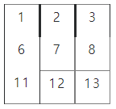

# 10587. List2 연습1

> NxN배열에서 각 요소에 대해서, 그 요소와 이웃한 요소와의 차의 절대값에 대한 합을 구한 후, 총 합을 구하는 프로그램을 만드시오.
>
> 다음에서 7에 이웃한 요소는 2, 6, 12, 8이다.
>
> 
>
> 1의 이웃한 요소는 2, 6이고, 2의 이웃한 원소는 1, 7, 3이다.
>
>  
>
> **입력**
>
> 첫 줄에 테스트케이스 T, 다음 줄부터 테스트케이스 별로 첫 줄에 N, 다음 줄부터 N개의 줄에 공백으로 구분된 1이상 99이하의 정수가 N개씩 제공된다.
>
> 1<=T<=10, 5<=N<=20
>
> 3
> 5
> 45 15 10 56 23 
> 96 98 99 40 69 
> 96 84 49 46 34 
> 16 64 81 4 11 
> 10 66 85 55 14 
> 5
> 44 91 64 73 62 
> 78 72 52 73 48 
> 44 88 55 75 24 
> 22 72 59 26 62 
> 87 11 64 79 40 
> 5
> 10 10 10 10 10
> 10 10 10 10 10
> 10 10 10 10 10
> 10 10 10 10 10
> 10 10 10 10 10
>
> **출력**
>
> \#과 테스트케이스 번호, 빈칸에 이어 모든 원소에 대한 이웃한 숫자와의 차의 절대값에 대한 총 합을 출력한다.
>
> \#1 2430
> \#2 2244
> \#3 0

- 풀이

```python
t = int(input())

for tc in range(1, t + 1):
    n = int(input())
    arr = [list(map(int, input().split())) for _ in range(n)]
    ans = 0  # 모든 원소에 대해 주변 원소와의 절대값의 합

    for i in range(n):
        for j in range(n):
            for di, dj in [(0, 1), (1, 0), (0, -1), (-1, 0)]:
                ni, nj = i + di, j + dj  # i, j의 주변 ni, nj
                if 0 <= ni < n and 0 <= nj < n:
                    ans += abs(arr[i][j] - arr[ni][nj])

    print(f'#{tc} {ans}')
```

