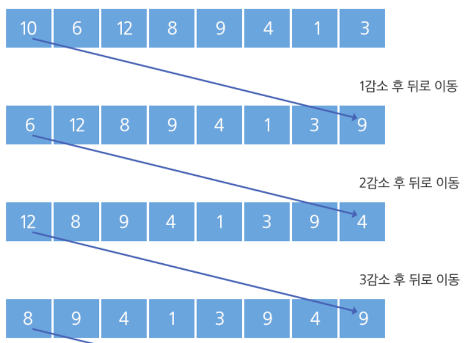
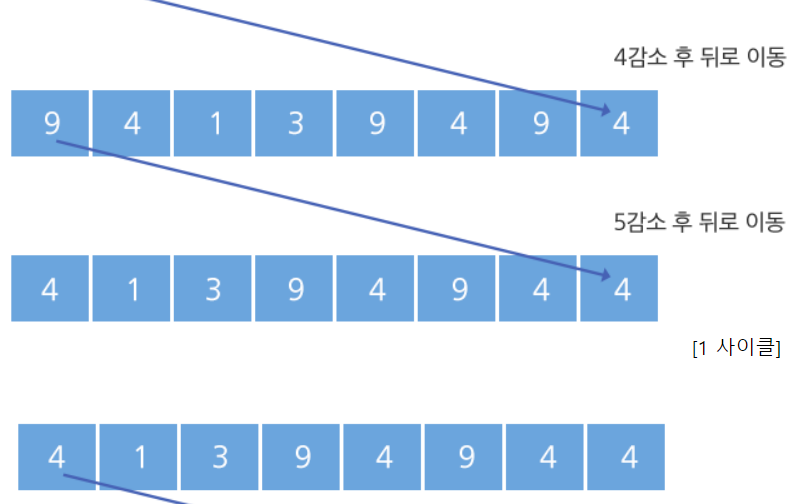
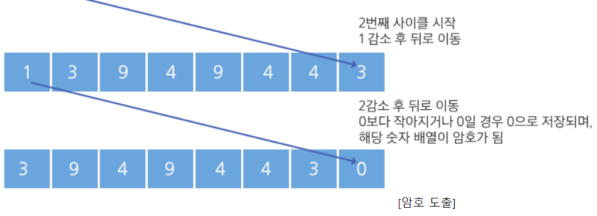

# 1225. 암호생성기

> https://swexpertacademy.com/main/code/problem/problemDetail.do?contestProbId=AV14uWl6AF0CFAYD&categoryId=AV14uWl6AF0CFAYD&categoryType=CODE&problemTitle=%EC%95%94%ED%98%B8&orderBy=FIRST_REG_DATETIME&selectCodeLang=ALL&select-1=&pageSize=10&pageIndex=1
>
> 다음 주어진 조건에 따라 n개의 수를 처리하면 8자리의 암호를 생성할 수 있다.
>
> \- 8개의 숫자를 입력 받는다.
>
> \- 첫 번째 숫자를 1 감소한 뒤, 맨 뒤로 보낸다. 
>
> 다음 첫 번째 수는 2 감소한 뒤 맨 뒤로, 그 다음 첫 번째 수는 3을 감소하고 맨 뒤로, 그 다음 수는 4, 그 다음 수는 5를 감소한다.
>
> 이와 같은 작업을 한 사이클이라 한다.
>
> \- 숫자가 감소할 때 0보다 작아지는 경우 0으로 유지되며, 프로그램은 종료된다. 이 때의 8자리의 숫자 값이 암호가 된다.
>
> 
>
> 
>
> 
>
> **[제약 사항]**
>
> 주어지는 각 수는 integer 범위를 넘지 않는다.
>
> 마지막 암호 배열은 모두 한 자리 수로 구성되어 있다.
>  
> **[입력]**
>
> 각 테스트 케이스의 첫 줄에는 테스트 케이스의 번호가 주어지고, 그 다음 줄에는 8개의 데이터가 주어진다.
>
> 1
> 9550 9556 9550 9553 9558 9551 9551 9551
> 2
> 2419 2418 2423 2415 2422 2419 2420 2415
> ........ 
> **[출력]**
>
> \#부호와 함께 테스트케이스의 번호를 출력하고, 공백 문자 후 테스트 케이스의 답을 출력한다.
>
> \#1 6 2 2 9 4 1 3 0
> \#2 9 7 9 5 4 3 8 0
> .......

- 풀이

```python
for tc in range(10):
    T = int(input())
    arr = list(map(int, input().split()))

    while True:
        result = False
        for i in range(5):
            arr[0] = arr[0] -i-1
            new_data = arr[1:]
            new_data.append(arr[0])
            arr = new_data[:]
            if arr[-1] <= 0:
                arr[-1] =0
                result = True
                break
        if result:
            break
    print('#{} {}'.format(T, ' '.join(map(str,arr))))
```