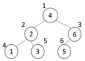

# 5176. 이진탐색

> https://swexpertacademy.com/main/learn/course/subjectDetail.do?courseId=AVuPDN86AAXw5UW6&subjectId=AWOVJ-_6qfsDFAWg#
>
> 1부터 N까지의 자연수를 이진 탐색 트리에 저장하려고 한다.
>
> 이진 탐색 트리는 어떤 경우에도 저장된 값이 왼쪽 서브트리의 루트 <현재 노드 <오른쪽 서브 트리의 루트인 규칙을 만족한다.
>
> 추가나 삭제가 없는 경우에는, 완전 이진 트리가 되도록 만들면 효율적인 이진 탐색 트리를 만들수 있다.
>
> 다음은 1부터 6까지의 숫자를 완전 이진 트리 형태인 이진 탐색 트리에 저장한 경우이다.
>
> 
>
> 완전 이진 트리의 노드 번호는 루트를 1번으로 하고 아래로 내려가면서 왼쪽에서 오른쪽 순으로 증가한다.
>
> N이 주어졌을 때 완전 이진 트리로 만든 이진 탐색 트리의 루트에 저장된 값과, N/2번 노드(N이 홀수인 경우 소수점 버림)에 저장된 값을 출력하는 프로그램을 만드시오.
>
> **[입력]**
>
> 첫 줄에 테스트케이스의 수 T가 주어진다. 1<=T<=50
>
> 다음 줄부터 테스트 케이스의 별로 N이 주어진다. 1<=N<=1000
>
> ```
> 3
> 6
> 8
> 15
> ```
>
> **[출력]**
>
> 각 줄마다 "#T" (T는 테스트 케이스 번호)를 출력한 뒤, 답을 출력한다.
>
> ```
> #1 4 6
> #2 5 2
> #3 8 14
> ```

- 풀이

```python
def inorder(root):
    global num
    if 1 <= root <= N:
        # 왼쪽
        left = root * 2
        if 0 < left < N + 1:
            inorder(left)
        tree[root] = num
        num += 1
        # 오른쪽
        right = root * 2 + 1
        if 0 < right < N + 1:
            inorder(right)


T = int(input())
for tc in range(1, T + 1):
    N = int(input())

    tree = [0] * (N + 1)

    num = 1
    inorder(1)
    print(f"#{tc}", tree[1], tree[N // 2])
```

- 해설 1

```python
def inorder(n,):
    global order
    if n <= N:
        inorder(2*n)
        tree[n] = order
        order += 1
        inorder(2*n+1)

T = int(input())
for tc in range(1,T+1):
    N = int(input())
    # E = N-1
    info = [i for i in range(N+1)]
    # print(info)
    tree = [0]*(N+1)
    order = 1
    inorder(1)
    print("#{} {} {}".format(tc, tree[1], tree[N//2]))
```

- 해설 2

```python
for tc in range(1,int(input())+1):
    N = int(input())
    T = [0]*(N+1)
    cnt = 1
    def inorder(v):
        global cnt
        if v > N: return
        inorder(v*2)
        T[v] = cnt
        cnt += 1
        inorder(v*2+1)
    inorder(1)
    print(T[1], T[N//2])
```

- 해설 3

  ```python
  T = int(input())
  
  def in_order(i):
      global cnt
      if i <= N:
          in_order(2*i)
          tree[i] = cnt
          cnt += 1
          in_order(2*i+1)
  
  for tc in range(1, T+1):
      N = int(input())
      tree = [0 for _ in range(N+1)]
  
      cnt = 1
      in_order(1)
      print("#{} {} {}".format(tc, tree[1], tree[N//2]))
  ```

  
