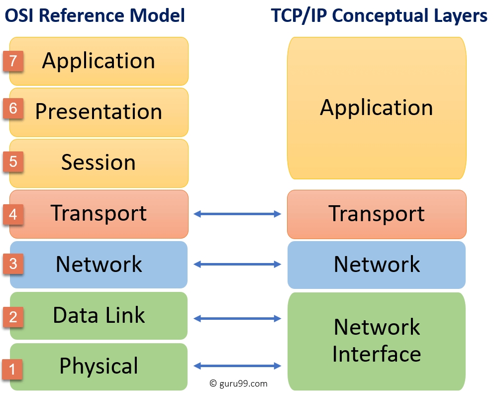

## OSI 7 계층

- 국제 표준화 기구 ISO (International Standardization Organization) 개발
- 컴퓨터 네트워크 프로토콜 디자인과 통신을 계층을 나누어 설명한 개방형 시스템 상호 연결 모델
- 각 계층 : 독립적 구성, 하위 계층 기능 이용해서 상위 계층에 기능 제공
- 1계층 물리 계층 ~ 7계층 애플리케이션 계층

- 계층 지날 때마다 헤더 (Header) 추가
  - 헤더 : 해당 계층 기능 관련 제어 정보 포함
- 제어 정보 : 운영체제가 제공하는 프로토콜이
  - 송신 : 계층 지날 때마다 추가
  - 수신 : 계층 지날 때마다 제거

### 특징

|                  계층                  |                             설명                             |   프로토콜   |        전송단위         |      장비      |
| :------------------------------------: | :----------------------------------------------------------: | :----------: | :---------------------: | :------------: |
|   응용 계층 (Application Layer)   |    사용자와 네트워크 간 응용서비스 연결, 데이터 생성    |  HTTP, FTP   |         데이터          |     호스트     |
|  표현 계층 (Presentation Layer)   |          데이터 형식 설정, 부호교환 암/복호화           |  JPEG, MPEG  |         데이터          |     호스트     |
|     세션 계층 (Session Layer)     |        송수신 간 논리적 연결 연결 접속, 동기제어        | RPC, NetBIOS |         데이터          |     호스트     |
|    전송 계층 (Transport Layer)    | 송수신 프로세스 간 연결 신뢰성 통신 보장 데이터 분할, 재조립, 흐름/오류/혼잡 제어 |   TCP, UDP   | 세그먼트 (Segment) |   L4 스위치    |
|   네트워크 계층 (Network Layer)   |         단말기 간 데이터 전송 위한 최적화 경로 제공          |   IP, CMP    |   패킷 (Packet)    |     라우터     |
| 데이터링크 계층 (Data Link Layer) | 인접 시스템 간 데이터 전송, 전송 오류 제어 동기화, 오류/흐름/회선 제어 |  HDLC, PPP   |   프레임 (Frame)   | 브리지, 스위치 |
|    물리 계층 (Physical Layer)     |   0, 1 비트 정보 회선에 보내기 위한  전기적 신호 변환   |   RS-232C    |       비트 (Bit)        |  허브, 리피터  |

### 장비

- 1계층 (물리 계층)

  |  장비  |                             설명                             |
  | :----: | :----------------------------------------------------------: |
  |  허브  | 여러 대 컴퓨터 연결해서 네트워크로 보내거나 하나 네트워크로 수신 정보를 여러 대 컴퓨터로 송신 |
  | 리피터 | 디지털 신호 증폭 신호가 약해지지 않고 컴퓨터로 수신되도록 함 |

- 2계층 (데이터링크 계층)

  |               장비                |                             설명                             |
  | :-------------------------------: | :----------------------------------------------------------: |
  |              브리지               |   두 개 근거리통신망 (LAN) 연결하는  통신망 연결 장치   |
  |             L2 스위치             | 느린 전송속도 브리지, 허브 단점 개선 출발지에서 들어온 프레임 (Frame)을 목적지 MAC 주소 기반으로 빠르게 전송 |
  | NIC (Network Interface Card) | 외부 네트워크 접속해서 가장 빠른 속도로 데이터 송수신 컴퓨터 내 설치 |
  |            스위칭 허브            |                    스위치 기능 가진 허브                     |

  - L2 스위치

    |         방식         |                            설명                            |
    | :------------------: | :--------------------------------------------------------: |
    | Store and Forwarding |               데이터 전부 수신 후 다음 처리                |
    |     Cut Through      |            데이터 목적지 주소 확인 후 바로 전송            |
    |    Fragment Free     | 프레임 앞 64 바이트만 읽어서 에러 처리 후 목적지 포트 전송 |

- 3계층 (네트워크 계층)

  |         장비          |                             설명                             |
  | :-------------------: | :----------------------------------------------------------: |
  |        라우터         | LAN과 LAN 혹은 WAN 연결하는 인터넷 네트워킹 장비 패킷 위치 추출해서 최적 경로 지정하고 경로 따라서 데이터 패킷 다음 장치 전송 라우팅 프로토콜 : 경로 설정 해서 목적지까지 안전하게 전달 |
  |      게이트웨이       | 프로토콜을 서로 다른 통신망에 접속하는 장치 LAN에서 다른 네트워크 데이터 송수신 출입구 역할 |
  |       L3 스위치       | IP 레이어에서 스위칭 수행해서 외부 전송 라우터와의 경계 모호 |
  | 유무선 인터넷 공유기  | 외부에서 들어오는 인터넷 라인 연결 -> 유선으로 여러 대 기계 연결하거나 -> 무선 신호 송출해서 여러 대 컴퓨터 하나 인터넷 라인 공유 |
  | 망 (백본) 스위칭 허브 |              광역 네트워크 커버하는 스위칭 허브              |

- 4계층 (전송 계층)

  |   장비    |                             설명                             |
  | :-------: | :----------------------------------------------------------: |
  | L4 스위치 | TCP/UDP 스위칭 수행 FTP, HTTP 구분해서 스위칭하는 로드 밸런싱 애플리케이션 레이어에서 파악 가능한 이메일 내용 등 정교한 로드 밸런싱 불가 TCP/UDP 포트번호 분석해서 포워딩 결정, QoS와 GLB / SLB 기능 제공 스위치 |

  

