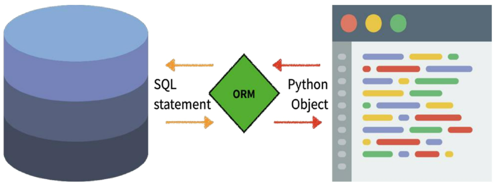

## Model

### Model

- 단일 데이터 정보 : 필드, 동작 포함
- 저장 DB 구조 (layout)
- model을 통해 데이터 접속, 관리
- 각각의 model : 하나의 DB 테이블에 mapping

### Database

- DB  : 체계화 데이터 모임
- Query : 데이터 조회 명령어 - 조건 -> 추출, 조작

### DB 기본 구조

- Schema : 자료 구조, 표현방법, 관계 정의
- Table 
  - field, column, attribute
  - record, row, tuple

## ORM

### ORM

- `Object-Relational-Mapping`
- OOP 언어 -> 시스템 간 (Django - SQL) 데이터 변환 프로그래밍 기술
- OOP 프로그래밍에서 RDMBS 연동 시 : DB ~ OOP 언어 간 호환 X 데이터 변환
- 내장 Django ORM

### 장단점

- 장점
  - SQL 몰라도 DB 조작 가능
  - 객체 지향적 접근 -> 생산성 high
- 단점
  - ORM 만으로 구현 X

### 사용 이유

- DB를 Object로 조작하기 위해

## Migrations

- model에 생긴 변화

### 명령어

- `makemigrations` 
- `migrate` : 마이그레이션 (설계도) DB 반영, 모델 변경 사항 ~ DB 스키마 동기화
- `sqlmigrate` : 마이그레이션 SQL 구문
- `showmigrations` : 전체 상태

## Database API

## CRUD

## Admin Site